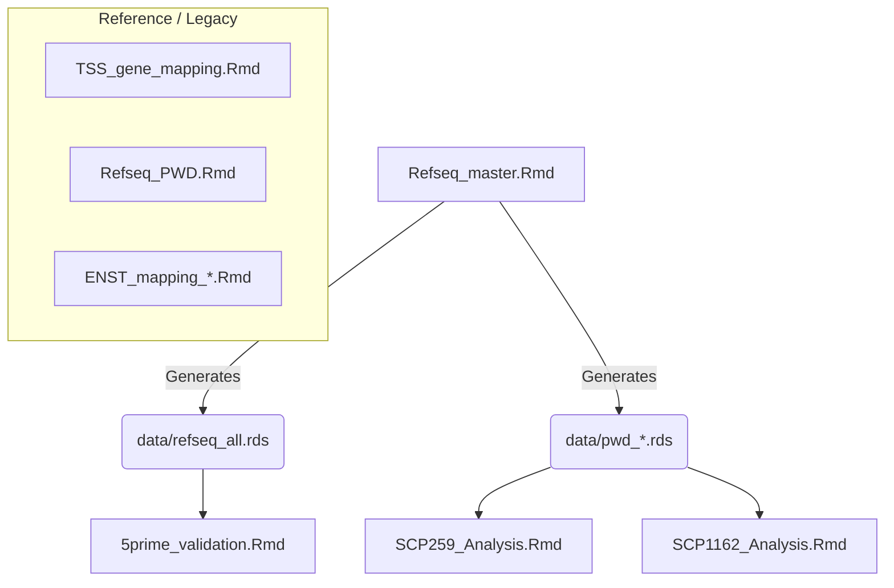

# Phenotypic Plasticity: Expression Variability × Methylation Conservation

This repository contains analysis code for the **phenotypic plasticity project**, which links **gene expression variability across epithelial cell types (single‑cell RNA‑seq)** to **DNA methylation divergence (WGBS PWD)** across regulatory contexts.

The core scientific question is:

> Do genes that are more *expression‑plastic* across epithelial cell types show **more conserved** or **more divergent** DNA methylation in promoters and enhancers?

---

## 🧠 Conceptual Overview

### Expression (Plasticity Proxy)

* **Data sources:**
    * **SCP259:** Normal vs. Inflamed (UC) colon (Epithelial cells only).
    * **SCP1162:** Normal vs. Tumor (MMRd & MMRp) (Epithelial cells only).
* **Pipeline:**
    1.  Collapse transcript‑level rows → **gene‑level counts** (summation).
    2.  Per‑cell normalization: **CP10k** (Counts Per 10k).
    3.  Log transform: **log2(CP10k + 1)**.
    4.  Average within epithelial **cell types**.
    5.  **Metrics per gene:**
        * `mean_expr`: Mean expression across epithelial cell types.
        * `var_expr`: Variance across epithelial cell types (**Plasticity Proxy**).

### Methylation (PWD)

* **Data source:** Whole‑genome bisulfite sequencing (WGBS).
* **Metric:** **Pairwise Methylation Divergence (PWD)**.
* **Regulatory Contexts:**
    * **TSS500:** ±500 bp around the **5′‑most TSS** per gene.
    * **pELS:** Proximal Enhancer-Like Signatures (mapped to nearest gene).
    * **dELS:** Distal Enhancer-Like Signatures (mapped to nearest gene).
* **Aggregation:** Interval‑level PWD is aggregated to the gene level using a **CpG‑weighted mean**.

---

## 🏗️ 1. Master Data Generation (Upstream)

This script must be run **first**. It generates the foundational data structures (gene models, intervals, and PWD tables) used by all downstream analysis scripts.

### `Refseq_master.Rmd`

🚨 **Master Pipeline: Intervals & Methylation**

* **Builds `refseq_all`:** Consolidates UCSC RefSeq and KnownGene tables into a single master annotation.
* **Enforces 5'–Most Rule:** Rigorously selects the single 5'–most transcript per gene (strand–aware) to define the canonical gene start.
* **Defines Intervals:** Generates coordinates for Promoters (`TSS500`), Gene Bodies (`TxBody`, `CDS`), and regulatory features (`pELS`, `dELS`, `CGI`, `TF_peaks`) mapped to the nearest gene.
* **Calculates PWD:** Runs the memory–efficient, chunked PWD calculation engine for **all** defined intervals and sample pairs.

**Output:** Saves gene-level RDS files (e.g., `pwd_TSS500.rds`, `pwd_pELS.rds`) to the `/data` folder.

---

## 📊 2. Main Analysis Scripts (Downstream)

These scripts consume the PWD files generated above and integrate them with single-cell expression data to produce the final figures.

### `SCP259_Analysis.Rmd`

**Dataset:** Normal Colon vs. Ulcerative Colitis (UC).

* **Expression Processing:**
    * Loads raw SCP259 matrices.
    * Computes `mean` and `variance` of expression for **Healthy** and **UC** epithelial cells.
* **Integration:** Merges expression stats with `pwd_TSS500`, `pwd_pELS`, and `pwd_dELS`.
* **Visualization:** Generates scatter plots of **Methylation Divergence (X)** vs. **Expression Plasticity (Y)**.
* **Output:** Summary tables and plots for Healthy/UC conditions.

### `SCP1162_Analysis.Rmd`

**Dataset:** Normal Colon vs. Colorectal Cancer (MMRd & MMRp).

* **Robust ID Mapping:** Implements advanced logic to clean and map messy gene IDs (e.g., `ENSG..._Symbol`, version numbers) to valid HGNC symbols.
* **Expression Processing:** Uses **BPCells** for memory-efficient processing of the large SCP1162 dataset.
* **Grouping:** Separately processes **Normal**, **Tumor_MMRd**, and **Tumor_MMRp** epithelial populations.
* **Visualization:** Compares plasticity vs. conservation across normal and tumor states.

---

## ✅ 3. Validation & Quality Control

### `5prime_validation.Rmd`

**Methodological Validation: Why the 5'–most TSS?**

* **Goal:** Scientifically validates the decision to use the 5'–most TSS as the representative promoter.
* **Analysis:**
    * Identifies genes with multiple unique TSSs.
    * Compares PWD of the 5'–most TSS against alternative downstream TSSs.
    * **Key Insight:** Demonstrates that phenotypic plasticity signals are best captured by the canonical 5' start site.

### `ENST_data_check.Rmd`

**Data Quality Control**

* Diagnoses duplicate transcripts and one‑to‑many mappings.
* Documents decisions made regarding gene ID collapsing and filtering.

---

## 📦 4. Supportive, Legacy, & Reference Modules

These files are retained for reproducibility and transparency. While their core logic has been integrated into the **Master Data Generation** pipeline, they serve as independent references for specific methodological steps.

### `TSS_gene_mapping.Rmd`
**Legacy Module: TSS Definition**
* Defines the logic for selecting the **5′‑most TSS per gene** (strand‑aware) and building promoter windows.
* **Status:** Its logic is now fully incorporated into `Refseq_master.Rmd`. Retained as a standalone record of the interval definition strategy.

### `Refseq_PWD.Rmd`
**Legacy Module: Methylation Calculation**
* Contains the original standalone code for calculating PWD from interval tables.
* **Status:** The PWD calculation engine has been optimized and moved to `Refseq_master.Rmd`. This file is useful for auditing the math behind the divergence metric.

### `ENST_mapping_Ensembl.Rmd` & `ENST_mapping_UCSC.Rmd`
**Exploratory Notebooks: ID Resolution**
* These scripts explore the complex mapping between Ensembl transcript IDs (ENST) and gene symbols.
* **Status:** They document the rationale behind the final ID selection strategy used to merge the Single-Cell (Expression) and WGBS (Methylation) datasets.

---

## 📂 File Dependency Graph

